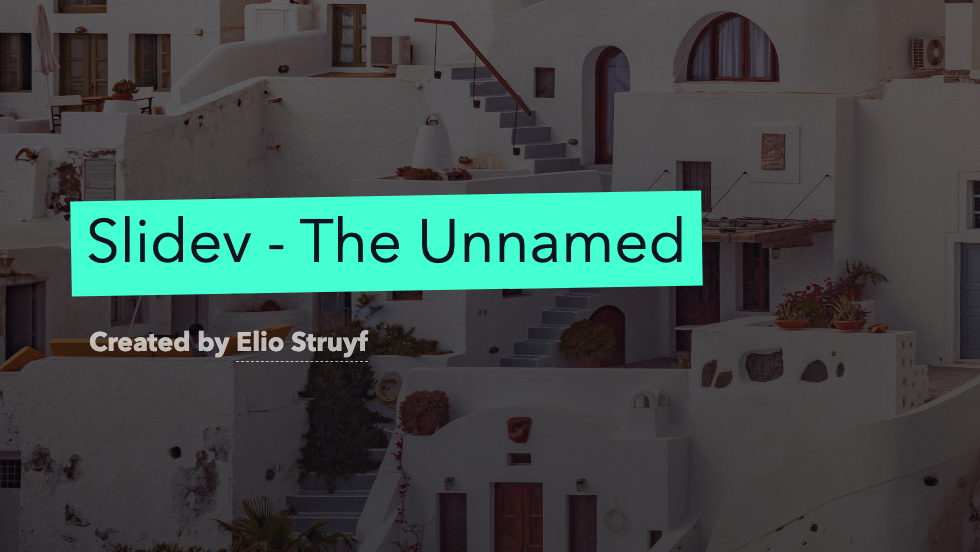
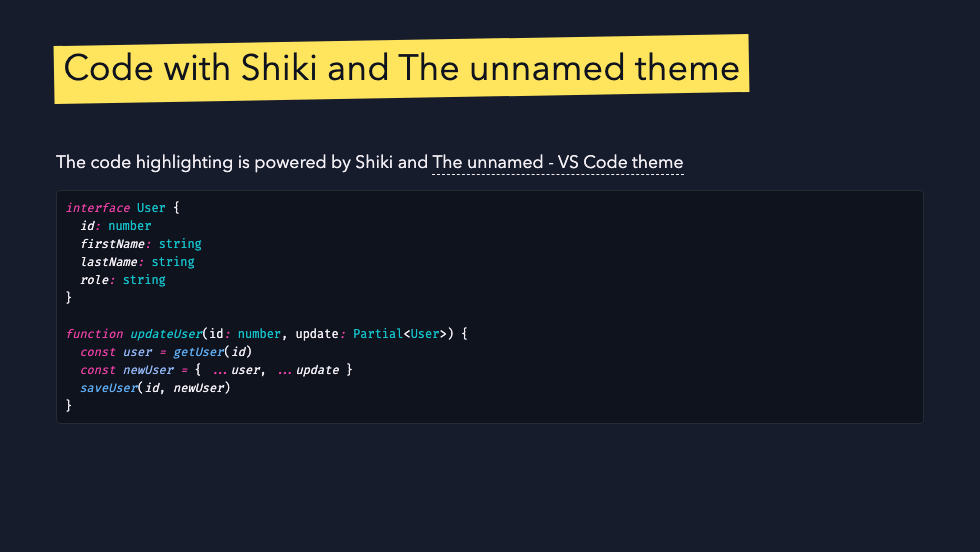

# Slidev Theme - The unnamed

[](https://www.npmjs.com/package/slidev-theme-the-unnamed)

A [Slidev](https://sli.dev/) theme based on the [The unnamed - VS Code theme](https://marketplace.visualstudio.com/items?itemName=eliostruyf.vscode-unnamed-theme) by [Elio Struyf](https://elio.dev).

## Usage

Add the following frontmatter to your `slides.md`. Start Slidev then it will prompt you to install the theme automatically.

```yaml
---
theme: the-unnamed
---
```

## Layouts

The theme currently has the following layouts:

- `default`
- `cover`
- `section`
- `about-me`
- and the ones from Slidev itself

### Cover



**Usage**

```yaml
---
layout: cover
background: <image url> (optional)
---
```

### About me


**Usage**

```yaml
---
layout: about-me

helloMsg: Hello!
name: <name>
imageSrc: <image url>
job: <job title>
line1: 
line2: 
social1: 
social2: 
social3: 
---
```

### Default




## Cusomizations

You can customize the theme by adding the following frontmatter to your `slides.md`.

```yaml
themeConfig:
  background: "#161C2C"
  color: "#F3EFF5"
  
  accents-teal: "#44FFD2"
  accents-yellow: "#FFE45E"
  accents-red: "#FE4A49"
  accents-lightblue: "#15C2CB"
  accents-blue: "#5EADF2"
  accents-vulcan: "#0E131F"

  code-background: "#0F131E"
  code-border: "#242d34"
```

<br />
<br />

[](https://visitorbadge.io/status?path=https%3A%2F%2Fgithub.com%2Festruyf%2Fslidev-theme-the-unnamed)